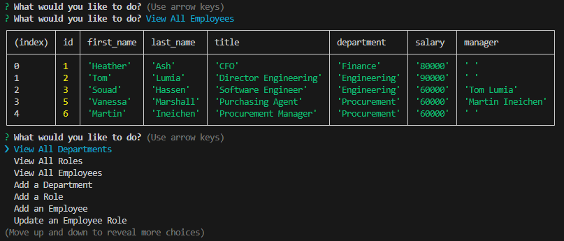

# Employee Tracker
  

## Description

This application manages a company's employee database. A business owner will be able to view and manage the departments, roles, and employees in their company for a better organization and planning of their business.

## Table Of Contents

  - [Installation](#installation)
  - [Usage](#usage)
  - [License](#license)
  - [Demonstration](#demonstration)
  - [Tests](#tests)
  - [Questions](#questions)

## Installation

This application requires you install the following: 
- Node.js
- Inquirer
- PostgreSQL

Once installed:
- Clone the repository to your local machine
- Open the terminal and ensure you are in the right path
- Run the command **npm i** to download the packages

## Usage

Once all the packages are installed, run **npm start** on the terminal to start the application. 
The user can the choose to:
- View all departments
- View all roles
- View all employees
- Add a department
- Add a role
- Add an employee
- Update employee by manager
- Update employee by department
- View employees by department
- Delete departments, roles and employees
- View the total utilized budget of a department

The below screenshot is an example of: View all employees

## License

This project is licensed under the MIT License. To learn more about this means, click the license button at the top.

## Demonstration

Visit this [link](https://app.screencastify.com/v2/manage/videos/Ecuv6uek3vkLPXDlyHDa) to see a demo of the application.

## Tests

N/A

## Questions

GitHub Profile: https://github.com/souad-hb

If you have any additional questions, feel free to contact me at: souadsalahh@gmail.com 
